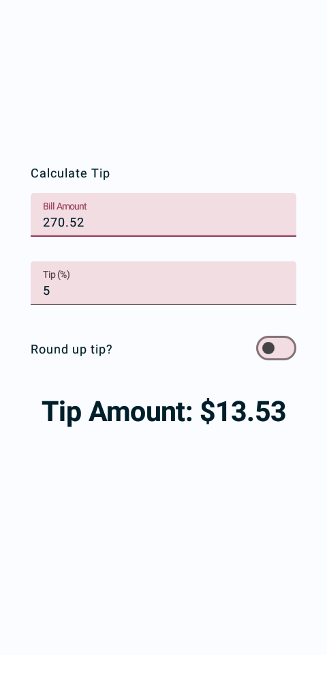
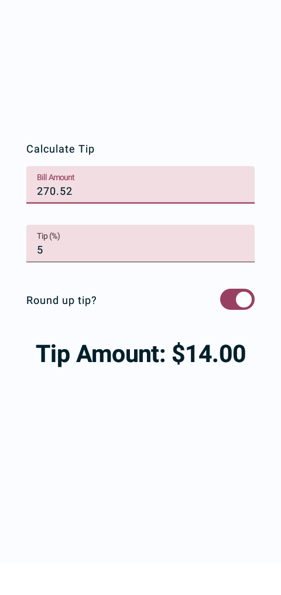

# Calculate The Tip  - Materi 5 (Layouts)

## Mata Kuliah : Praktik Pemrograman Mobile 1
==============================

Latihan Codelab untuk membuat kalkulator tip interaktif yang dapat menghitung dan membulatkan jumlah tip secara otomatis saat memasukkan jumlah tagihan dan persentase tip. 

## Link Latihan Codelab
https://developer.android.com/codelabs/basic-android-compose-calculate-tip

## Hasil Latihan

    
    

